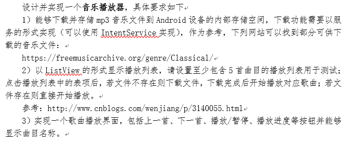
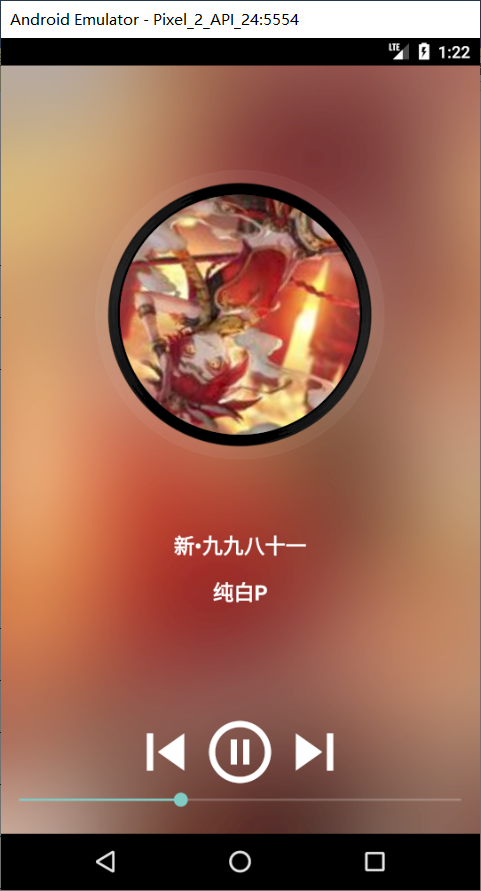
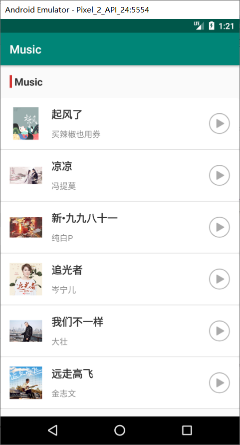

Music
=========================


Introduction
------------


Screenshots
-----------





Libraries Used
--------------
```
    def lifecycle_version = "2.1.0"
    implementation "androidx.lifecycle:lifecycle-extensions:$lifecycle_version"
    annotationProcessor "androidx.lifecycle:lifecycle-compiler:$lifecycle_version"
    def room_version = "2.2.0-rc01"
    implementation "androidx.room:room-runtime:$room_version"
    annotationProcessor "androidx.room:room-compiler:$room_version"
    implementation 'androidx.gridlayout:gridlayout:1.0.0'
    implementation "com.squareup.okhttp3:okhttp:4.2.2"
    implementation 'de.hdodenhof:circleimageview:3.0.0'
    implementation 'com.github.bumptech.glide:glide:4.9.0'
    implementation 'jp.wasabeef:glide-transformations:4.0.1'
    implementation 'androidx.recyclerview:recyclerview:1.1.0'
    implementation  "com.google.code.gson:gson:2.8.4"
```